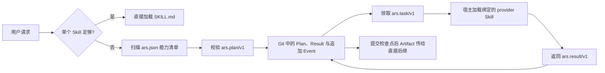

# Ars-Noctis

Ars-Noctis 是面向 Agent Skills 的轻量级组合协议。Ars 为标准 Skill 增加一个很小的能力清单；Noctis 在确有需要时把多个能力组成可恢复的 Task DAG。单个 Skill 始终可以独立触发，不需要安装或运行 Noctis。

## 架构



系统只有三层：

1. **Skill 包层**：遵循 [Agent Skills 规范](https://agentskills.io/specification) 的 `SKILL.md`、可选脚本、引用和资产，负责安装、触发与独立执行。
2. **能力契约层**：可选 `ars.json` 声明 capability、统一 Task/Result envelope 和可能副作用。Noctis 只扫描 manifest，不读取其他 Skill 正文，也不把控制面自身注册成可递归调度的 provider。
3. **状态层**：Noctis 把 Run、Plan、Result 和追加事件保存到 Git 跟踪的 `.ars/runs/<run-id>/`。当前 worktree 的 Git 元数据目录只保存本机 claim 与当前机器授权，可以删除重建且不会进入提交。宿主仍负责真正加载 Skill 与使用工具。

## 为什么这样选

| 社区方案 | 采用的稳定概念 | 没有引入的部分 |
| --- | --- | --- |
| [Agent Skills](https://agentskills.io/specification) | 目录式安装、metadata 触发、渐进披露 | 不扩展其 SKILL.md 核心格式 |
| [MCP](https://modelcontextprotocol.io/docs/learn/architecture) | 能力发现与执行分离、显式接口 | 不为本地 Skill 启动 JSON-RPC 服务 |
| [A2A](https://a2a-protocol.org/latest/specification/) | Task 状态、Artifact、终态不可重开 | 不实现网络传输、消息流和 Agent Card |
| [LangGraph](https://docs.langchain.com/oss/python/langgraph/persistence) | checkpoint、interrupt、恢复前保证副作用幂等 | 不绑定图运行时或模型 SDK |
| [CrewAI Flows](https://docs.crewai.com/en/concepts/flows) | 结构化状态与显式恢复入口 | 不把本地 SQLite 当作跨机器事实源，也不引入 Crew、decorator 或 LLM 依赖 |
| [OpenAI Agents SDK](https://openai.github.io/openai-agents-python/handoffs/) | 结构化 handoff、输入过滤、guardrail 边界 | 不绑定模型 provider 或会话实现 |
| [AutoGen](https://microsoft.github.io/autogen/stable/user-guide/agentchat-user-guide/tutorial/teams.html) | 单 Agent 优先、复杂时才组 team | 不采用共享群聊作为数据总线 |

这些框架面向常驻 Agent 应用；本仓库面向可复制的 Skill 包和本地编码 Agent。直接依赖其中任何运行时都会增加安装、模型和宿主耦合，因此只保留已验证的不变量。

## 技术选型

- **Python 3.11+ 标准库**：CLI 不依赖 PyYAML、Pydantic、Web 服务或特定模型 SDK。
- **追加式 JSON + Git**：Plan、Result 和每个状态事件都是独立严格 JSON；Git commit 是持久检查点，clone 后可重放恢复，不提交二进制数据库。
- **本机 SQLite 缓存**：只协调当前 worktree 的 claim 与当前机器授权；删除缓存不会丢失持久状态，旧授权不会因 clone 自动生效。
- **协作式调度**：脚本返回 Task envelope，当前 Agent 宿主加载 provider Skill；不伪造一个不存在的通用 Skill 调用 API。
- **显式 Artifact locator**：区分 workspace path、Git commit、HTTP(S) URI 和 inline data，并验证本地证据与完整 commit。

## 目录

```text
skills/
├── ars/          # 创建、迁移和验证 Ars manifest
├── noctis/       # 计划、状态、领取、完成与恢复
├── implement/    # 代码和配置变更
├── code-review/  # 只读变更审查
└── verify/       # 行为验收与证据
```

每个 Skill 均可独立安装。`noctis-exec` 和 `noctis-continue` 已合并回 `noctis`，因为它们共享同一个状态机和恢复不变量；`to-ars` 已合并回 `ars`，因为迁移只是 Skill 作者工作流的一个入口。

这是破坏性状态迁移：旧 `ars.yaml`、`Noctis/registry.yaml`、`Noctis/**/*.md` 和 `.ars/noctis.sqlite3` 不会被新运行时自动当作事实源。仍在执行的旧 Run 应先依据 workspace、Git 和外部证据对账，再显式创建 Git-backed Run；不要把旧文件或数据库存在直接等同于新 Task 已完成。

## 公共契约

- `ars.skill/v1`：provider ID、SemVer、capability、`ars.task/v1 -> ars.result/v1` 和副作用上界。
- `ars.plan/v1`：一个 Run 的 workspace 和 Task DAG；Task 显式绑定 provider，不使用中心注册表或路径优先级。
- `ars.task/v1`：本机 claim、attempt、revision、workspace、Git checkpoint、resolved inputs、验收条件、grant 和幂等键。
- `ars.result/v1`：终态、Artifact、evidence 和实际 effect receipt。
- `ars.run-record/v1` 与 `ars.event/v1`：不可变 Run 元数据和按 Task revision 追加的持久状态转换。

Task 的持久状态为 `pending -> completed | failed | blocked | input-required`，也可显式变为 `canceled`；`working` 只是当前机器缓存中的 claim。代码、Result 和 Event 提交并推送后才构成跨机器检查点。新 clone 重放已提交事件：已有 Result 的 Task 保持终态，没有 Result 的旧 claim 回到 `pending`。`completed` 与 `canceled` 不重开；后续修订创建新 Task 或新 Run。

## 快速使用

```powershell
python skills/ars/scripts/ars.py validate --skill skills/implement
python skills/noctis/scripts/noctis.py catalog --skills-root skills
python skills/noctis/scripts/noctis.py plan-check --project . --plan skills/noctis/assets/plan.example.json --skills-root skills
```

创建 Run、授权、领取、完成和恢复命令见 `skills/noctis/references/operations.md`。仓库级校验：

```powershell
python scripts/validate_repository.py --quick-validate <path-to-quick_validate.py>
```

触发语料结构校验不等于模型评测。真实 precision/recall 仍通过独立 evaluator 运行：

```powershell
python scripts/evaluate_triggers.py --evaluator <evaluator.py> --min-precision 0.8 --min-recall 0.8
```
