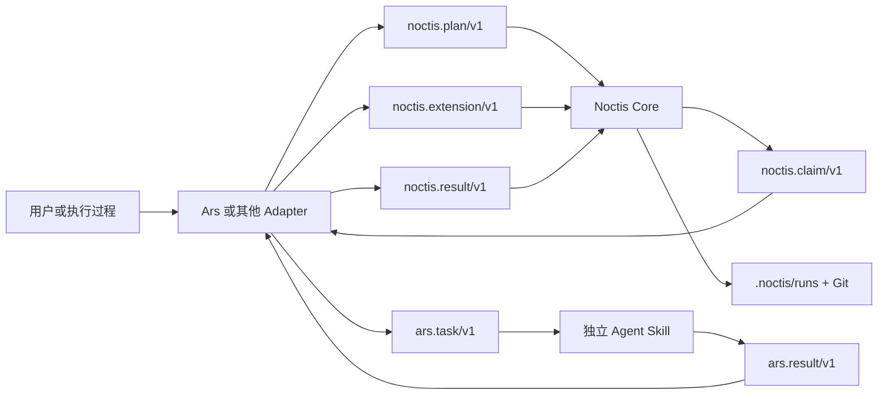

# Ars-Noctis

Ars-Noctis 包含两个方向明确、可独立安装的组件：

- **Noctis Core** 是协议无关的、Git-backed 的持久 Task DAG。它只认识 executor、request、requirement、result 与追加事件。
- **Ars** 是 Agent Skills 组合协议，也是 Noctis 的一个外部适配器。它发现 `ars.json`，并把 Ars Plan、Task 与 Result 映射到 Noctis 公共契约。

依赖方向固定为 `Ars -> Noctis public contract`。Noctis 不导入 Ars、不扫描 `ars.json`，也没有 implement、code-review 或 verify 的专用流程。单个 Skill 始终可以独立触发，不需要安装 Noctis。

## 安装

项目接入使用 Node.js 22+，Ars 和 Noctis 运行时使用 Python 3.11+ 标准库与 Git。npm 包只负责安装独立 Skill，不通过 `postinstall` 修改项目，也不创建 `.noctis/runs`、授权 requirement、提交或推送 Git。

```powershell
# 临时使用最新版，默认安装 core profile：ars + noctis
npx ars-noctis@latest init

# 或安装全局命令
npm install -g ars-noctis@latest
ars-noctis init --profile full

# 运行过程中补装一个新 provider
ars-noctis init --skill verify

ars-noctis update
ars-noctis doctor
```

默认目标是当前项目的 `.agents/skills/`。`core` 只安装 Ars 与 Noctis；`full` 还安装当前发行包携带的 implement、code-review 与 verify。新增 provider 由 `distribution.json` 声明，初始化器不为具体 provider 编写分支。

安装记录位于 `.agents/skills/.ars-noctis.install.json`，只保存受管理文件的摘要和来源包版本。重复初始化是幂等的；本地修改或未管理的同名目录默认拒绝覆盖。`--replace-modified` 会先把旧目录移到 `.ars-noctis-backups/`，`--dry-run` 和 `--json` 可用于预检与自动化。

Python 不在 `PATH` 时，通过 `--python <可执行文件>` 或 `ARS_NOCTIS_PYTHON` 指定解释器。`init` 仍会完成文件安装并给出警告；`doctor` 会把缺少 Python、`sqlite3` 或 Git 作为运行时未就绪报告。

`ars-noctis update` 使用当前正在执行的 npm 包刷新已管理 Skill，不会自行升级 npm 包。需要新发行版时，先通过 npm 或 `npx ars-noctis@latest` 取得新 CLI，再运行 `update`。

## 架构



Noctis Core 有四个稳定职责：

1. 校验通用 Plan、Extension、Claim 与 Result。
2. 通过 Task revision 和 Run revision 串行化状态转换。
3. 将 Plan、Result 和追加 Event 保存到 `.noctis/runs/<run-id>/`，并从 Git clone 恢复。
4. 在本机 SQLite 中保存可丢弃的 claim 与当前机器授权。

Adapter 负责所有领域语义。例如 Ars adapter 负责 provider 发现、capability/effect 校验、workspace 与 Git Artifact 证据、`ars.task/v1` 和 `ars.result/v1`；这些内容不进入 Noctis Core。

## 动态 Task

Run 创建后可随时追加 Task，包括 Run 已经完成之后。`noctis.extension/v1` 包含来源、可选的新 executor 快照和一个或多个新 Task。新增 Task 可以依赖已有 Task，已有 Task 与 executor 不可修改。

因此 `fix` 不是 Noctis 的异常分支，`verify` 也不是预置阶段。它们只是 adapter 在运行过程中追加的普通 Task：

```text
初始 Plan: implement-change -> review-change
用户追加:  implement-change -> verify-change
执行器发现: review-change -> address-finding
```

每次扩展比较 `expected_run_revision`。同一 revision 上只有一个扩展可以成功，失败方读取新状态后重新合并，避免静默覆盖并发加入的工作。

## 技术选择

| 社区方案 | 采用的稳定概念 | 没有引入的部分 |
| --- | --- | --- |
| [Agent Skills](https://agentskills.io/specification) | 目录安装、metadata 触发、渐进披露 | 不扩展 `SKILL.md` 核心格式 |
| [MCP](https://modelcontextprotocol.io/docs/learn/architecture) | 能力发现与执行分离、显式接口 | 不实现网络传输或本地 JSON-RPC 服务 |
| [A2A](https://a2a-protocol.org/latest/specification/) | Task 状态、Artifact、终态 | 不实现 Agent Card、消息流或远程协议 |
| [LangGraph](https://docs.langchain.com/oss/python/langgraph/persistence) | checkpoint、恢复、幂等 | 不绑定图运行时或模型 SDK |
| [CrewAI Flows](https://docs.crewai.com/en/concepts/flows) | 结构化状态、显式恢复 | 不引入 Crew、decorator 或 LLM 依赖 |
| [OpenAI Agents SDK](https://openai.github.io/openai-agents-python/handoffs/) | 结构化 handoff、输入边界 | 不绑定模型 provider 或会话实现 |
| [AutoGen](https://microsoft.github.io/autogen/stable/user-guide/agentchat-user-guide/tutorial/teams.html) | 简单任务单 Agent 优先 | 不采用共享群聊作为状态总线 |

- **Python 3.11+ 标准库**：运行时不依赖 Pydantic、数据库服务或模型 SDK。
- **Node.js 22+ 安装器**：npm 只分发和管理 Skill 文件，不参与 Noctis 状态转换。
- **追加式 JSON + Git**：项目事实可审查、可 clone、可严格重放。
- **本机 SQLite 缓存**：位于 Git 元数据目录，只协调 claim 和当前机器授权，不是持久事实源。
- **不可变 executor 快照**：Run 不依赖之后变化的安装路径或运行时发现顺序。
- **不解释 opaque data**：Noctis 保存 request/output，但业务校验由 adapter 完成。

## 目录

```text
bin/                 # npm CLI 入口
lib/                 # 发行清单、安装事务与运行时诊断
distribution.json    # 声明可安装 Skill 和 profile
skills/
├── noctis/       # 协议无关 Core、公共契约和状态 CLI
├── ars/          # Ars manifest 工具与 Noctis adapter
├── implement/    # 独立代码变更 Skill
├── code-review/  # 独立只读审查 Skill
└── verify/       # 独立行为验收 Skill
```

每个目录都是独立 Agent Skill，不按固定路径导入另一个 Skill。Ars adapter 是 Ars Skill 内部脚本；它与 Noctis 只交换 JSON。

## 公共契约

- `noctis.plan/v1`：executor 快照与初始 Task DAG。
- `noctis.extension/v1`：带来源记录的追加 executor/Task 集合。
- `noctis.claim/v1`：某次领取的 executor、opaque request、前置结果、requirement 与 checkpoint。
- `noctis.result/v1`：终态、摘要与 opaque output。
- `noctis.run-record/v1`、`noctis.event/v1`：不可变 Run 元数据与追加状态转换。
- `ars.skill/v1`、`ars.task/v1`、`ars.result/v1`：Ars adapter 管理的 Agent Skills 协议。

Task 持久状态为 `pending -> completed | failed | blocked | input-required | canceled`。`working` 只是本机 claim 的投影视图。Run 完成后追加 Task 会重新变为 `submitted`，不是重开或改写旧 Task。

## 快速使用

直接创建通用 Run：

```powershell
python skills/noctis/scripts/noctis.py plan-check --plan skills/noctis/assets/plan.example.json
python skills/noctis/scripts/noctis.py run-create --project . --plan skills/noctis/assets/plan.example.json
```

通过 Ars adapter 创建输入：

```powershell
python skills/ars/scripts/ars.py validate --skill skills/implement
python skills/ars/scripts/ars_noctis.py plan-adapt --project . --plan skills/ars/assets/noctis-plan.example.json --skills-root skills > noctis-plan.json
python skills/ars/scripts/ars_noctis.py extension-adapt --project . --extension skills/ars/assets/noctis-extension.example.json --skills-root skills > noctis-extension.json
```

详细运行命令见 `skills/noctis/references/operations.md`，Ars 映射与旧 `.ars/runs` 显式迁移见 `skills/ars/references/noctis-adapter.md`。旧 Run 不会被 Noctis 自动读取。

仓库级验证：

```powershell
npm run check
python scripts/validate_repository.py --quick-validate <path-to-quick_validate.py>
npm pack --dry-run
```
