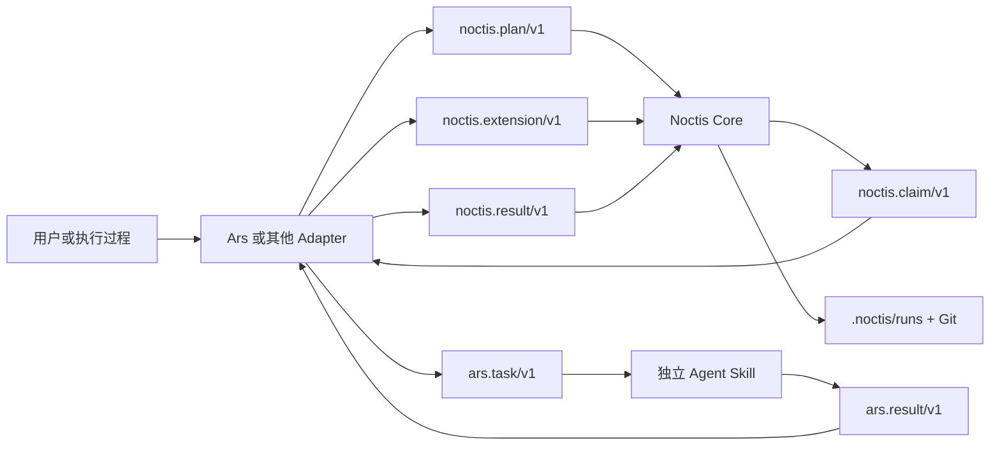

# Ars-Noctis

[](https://www.npmjs.com/package/ars-noctis)
[](https://github.com/YozoraTempest/Ars-Noctis/actions/workflows/ci.yml)
[](https://github.com/YozoraTempest/Ars-Noctis/actions/workflows/publish.yml)
[](LICENSE)

Ars-Noctis 发布一组可独立安装的 Agent Skills，以及一个协议无关、Git-backed 的持久 Task DAG：

- **Noctis Core** 只管理 executor、request、requirement、result、Task DAG 与追加事件。
- **Ars** 发现 `ars.json` provider，并通过 Adapter 将 Ars Plan、Task 与 Result 映射到 Noctis 公共 JSON 契约。

依赖方向固定为 `Ars -> Noctis public contract`。Noctis 不导入 Ars、不扫描 `ars.json`，也不为 implement、test、code-review、verify 或 fix 建立专用流程。

## 快速开始

安装器要求 Node.js 22+。Ars Adapter 要求 Python 3.11+ 与 Git；Noctis Core 另外要求标准库中的 `sqlite3`。实际检查项由每个 Skill 在 `distribution.json` 中声明。

在需要接入的项目根目录执行：

```powershell
# 在交互式终端中选择 profile、Skill 和安装目录；回车默认选择 core
npx ars-noctis@latest init

# Agent、脚本或 CI：非交互安装默认 core profile（ars + noctis）
npx ars-noctis@latest init --no-interactive

# 检查安装完整性和运行时
npx ars-noctis@latest doctor

# 查看可安装和已安装的 Skill
npx ars-noctis@latest list
```

默认安装到 `.agents/skills/`。npm 包没有 `postinstall`：单纯执行 `npm install` 不会修改项目，也不会创建 Noctis Run、授权 requirement、提交或推送 Git。

`init` 在真实 TTY 中且未传 `--profile`、`--skill`、`--json` 或 `--no-interactive` 时启动普通终端向导。向导可以选择已有 profile、逐项选择 Skills、修改项目内安装目录，并在写入前显示计划和请求确认；它不是全屏 TUI。CI、管道和其他 non-TTY 环境自动使用非交互模式。

## 安装内容

### Profile

| Profile | 包含内容 | 适用场景 |
| --- | --- | --- |
| `core` | `ars`、`noctis` | 需要组合协议与持久 Task DAG |
| `full` | `ars`、`noctis`、`spec`、`design`、`implement`、`test`、`code-review`、`verify` | 安装仓库当前提供的全部 Skill |

```powershell
npx ars-noctis@latest init --profile full
```

### Skill

| Skill | 职责 |
| --- | --- |
| `ars` | provider 发现、manifest 校验及 Noctis Adapter |
| `noctis` | 通用 Task DAG、状态转换、恢复、claim 与动态扩展 |
| `spec` | 高效澄清需求并生成边界明确、可验收的需求规格 |
| `design` | 将明确需求转换为技术设计和可独立验收的任务计划 |
| `implement` | 独立代码变更 Skill |
| `test` | 用风险驱动、单元测试优先的方法设计并执行最小充分测试 |
| `code-review` | 独立只读代码审查 Skill |
| `verify` | 独立行为验收 Skill |

每个 `skills/<name>/` 都是独立安装单元，可以由宿主直接触发，不要求 Noctis 存在。也可以只补装一个 Skill：

```powershell
npx ars-noctis@latest init --skill verify
```

`spec` 与 `design` 没有安装或执行依赖：`design` 可以消费 `spec` 产生的 `requirements.spec` Artifact，也可以直接接受明确的用户请求或现有需求文档。

`test` 可独立接受明确的测试目标，也可以消费需求、设计、实现或审查产物；实现过程中的普通回归仍由 `implement` 负责，既定场景的独立验收仍由 `verify` 负责。

Codex App 中这八个 Skill 都只允许 `$skill-name` 显式调用，不会默认注入模型上下文。

新增 Skill 只需在 `distribution.json` 中声明文件来源、运行时要求和可选自检；Node.js 安装器与 doctor 不为具体 Skill 或 provider 编写分支。

## 安装器 CLI

| 命令 | 作用 |
| --- | --- |
| `init [path]` | 交互选择或非交互安装 profile/Skills；默认选择 `core` |
| `update [path]` | 用当前 CLI 包刷新已管理 Skill |
| `doctor [path]` | 检查文件摘要、声明的运行时要求及 Skill 自检 |
| `list [path]` | 列出 profile、可用 Skill 与安装状态 |
| `remove [path] --skill <id>` | 移除受管理 Skill |

常用选项：

| 选项 | 作用 |
| --- | --- |
| `--project <path>` | 指定目标项目；与位置参数二选一 |
| `--skills-dir <path>` | 指定项目内的相对安装目录 |
| `--profile <name>` | 选择安装 profile |
| `--skill <id>` | 选择 Skill，可重复传入 |
| `--no-interactive` | 禁用 `init` 终端向导；未指定选择时安装默认 profile |
| `--python <path>` | 指定 Python 可执行文件 |
| `--dry-run` | 只报告计划，不写文件 |
| `--replace-modified` | 备份后替换有本地修改的目标 |
| `--json` | 输出适合自动化处理的 JSON |

Python 不在 `PATH` 时，可使用 `--python <path>` 或环境变量 `ARS_NOCTIS_PYTHON`。`init` 仍会完成文件安装并给出警告，`doctor` 则会把缺失或版本不满足要求报告为运行时问题。

`update` 不会自行升级 npm 包，它只使用当前正在执行的包刷新已管理文件。获取新发行版并更新项目时使用：

```powershell
npx ars-noctis@latest update
```

### 完整性与冲突处理

安装记录位于 `.agents/skills/.ars-noctis.install.json`，保存包版本与受管理文件的 SHA-256 摘要，不保存时间戳、绝对来源路径或 Git SHA。

- 重复执行相同安装是幂等的。
- 内容相同的现有 Skill 可以被安全接管。
- 未管理的不同内容或受管理文件的本地修改默认拒绝覆盖。
- `--replace-modified` 将旧目录保存在 `.ars-noctis-backups/` 后再替换。
- 写入使用临时目录、原子安装记录和失败回滚。
- 同一安装目录的 `init`、`update` 与 `remove` 使用排他锁串行化；锁内重新读取记录和目标状态。
- 安装路径、符号链接与 junction 会经过边界检查，不能逃出目标项目。
- `remove` 只删除受管理且未修改的内容；有修改时同样要求显式备份。

## 使用 Ars 与 Noctis

### 直接使用独立 Skill

如果一个 Skill 可以独立完成任务，让宿主直接触发 `.agents/skills/<name>/SKILL.md`。不要仅为了形式统一而创建 Noctis Run。

### 创建通用 Noctis Run

```powershell
$Noctis = ".agents/skills/noctis/scripts/noctis.py"
$Plan = ".agents/skills/noctis/assets/plan.example.json"

python $Noctis plan-check --plan $Plan
python $Noctis run-create --project . --plan $Plan
```

Noctis 不执行 executor，也不调用模型。调用方负责领取 Task、执行对应能力、提交 Result，并把 CLI 返回的 checkpoint 文件提交到 Git。

### 通过 Ars Adapter 创建 Run

```powershell
$Ars = ".agents/skills/ars/scripts/ars.py"
$Adapter = ".agents/skills/ars/scripts/ars_noctis.py"
$Noctis = ".agents/skills/noctis/scripts/noctis.py"
$Skills = ".agents/skills"

python $Ars validate --skill "$Skills/implement"
python $Adapter app-profile-init --project .
python $Adapter plan-adapt --project . --plan "$Skills/ars/assets/noctis-plan.example.json" --skills-root $Skills --run-config "$Skills/ars/assets/app-run-config.example.json" > noctis-plan.json
python $Noctis plan-check --plan noctis-plan.json
python $Noctis run-create --project . --plan noctis-plan.json
```

Ars Adapter 在数据进入 Core 前校验 provider、capability、effect、workspace 与 Artifact 证据，并冻结实际使用的 executor snapshot。Codex App runtime 按 `显式 > 仓库 profile > Task > Provider > Run > 主 Agent` 逐字段解析模型、推理强度和 `single/multi` Agent 模式；默认是 `single + 继承主 Agent`。Noctis 只接收通用 JSON，不创建 Agent 或调用模型。

个人 profile 保存在 Git common metadata 的 `ars-noctis/app-profile.json`，不会污染工作树。默认空 profile 继承主 Agent；可按 Skill 持久覆盖：

```powershell
python $Adapter app-profile-set --project . --skill code-review --agent-mode multi --model gpt-5.6-terra --reasoning-effort medium
```

单个 Skill 直接显式调用时由当前 Agent 执行。Ars Run 领取 Claim 后，主 Agent 把当前 App 能力和用户已显式选择的 Skills 作为临时 `ars.app-host/v1` 交给 `claim-dispatch`：`ready/single` 只执行当前任务已显式选择的 provider；`ready/multi` 按 dispatch 的 `spawn` 参数创建干净上下文的 subagent，并在首条消息显式调用快照指定的 provider Skill。若不希望 provider 内容进入主上下文，应配置 `multi`。当前宿主不支持指定模型或 subagent 时 dispatch 阻塞，不静默换模或回退为独立 CLI 进程。

## 动态追加 Task

安装 provider 与追加 Task 是两个不同动作：

1. `ars-noctis init --skill verify` 让宿主可以发现 `verify`。
2. `ars_noctis.py extension-adapt` 把新的 Ars 工作转换为 `noctis.extension/v1`。
3. `noctis.py run-extend` 把转换后的 Task 追加到现有 Run。

```powershell
$Adapter = ".agents/skills/ars/scripts/ars_noctis.py"
$Noctis = ".agents/skills/noctis/scripts/noctis.py"
$Skills = ".agents/skills"
$RunId = "replace-with-run-id"
$RunRevision = 0

python $Adapter extension-adapt --project . --extension "$Skills/ars/assets/noctis-extension.example.json" --skills-root $Skills > noctis-extension.json
python $Noctis extension-check --project . --run-id $RunId --extension noctis-extension.json
python $Noctis run-extend --project . --run-id $RunId --extension noctis-extension.json --expected-run-revision $RunRevision
```

Run 创建后、甚至完成后都可以追加 Task。`fix` 不是异常分支，`verify` 也不是预置阶段；它们只是带来源记录和依赖关系的普通 Task：

```text
初始 Plan: implement-change -> review-change
用户追加:  implement-change -> verify-change
执行器发现: review-change -> address-finding
```

扩展只能增加 executor snapshot 和 Task，不能修改已有定义。同一 worktree 的持久变更由本机 mutation mutex 串行化，每次扩展再比较 `expected_run_revision`；revision 冲突时读取最新状态、重新合并，再提交新的 Extension。

## 架构边界



Noctis Core 的稳定职责只有四项：

1. 校验通用 Plan、Extension、Claim 与 Result。
2. 通过本机 mutation mutex 与 Task/Run revision 串行化状态转换。
3. 将 Plan、Result 和追加 Event 保存到 `.noctis/runs/<run-id>/`，并从 Git clone 严格恢复。
4. 在本机 SQLite 中保存可丢弃的 mutation mutex、claim 与当前机器授权。

Git 跟踪的追加式 JSON + Git 是持久事实源；`.git/noctis/cache.sqlite3` 只是同一 worktree 的协调缓存，不是跨 clone 的分布式锁。Task 持久状态为 `pending -> completed | failed | blocked | input-required | canceled`，`working` 只是本机 claim 的投影视图。

公共契约：

- `noctis.plan/v1`：executor snapshot 与初始 Task DAG。
- `noctis.extension/v1`：带来源记录的追加 executor/Task 集合。
- `noctis.claim/v1`：executor、opaque request、前置结果、requirement 与 checkpoint。
- `noctis.result/v1`：终态、摘要与 opaque output。
- `noctis.run-record/v1`、`noctis.event/v1`：不可变 Run 元数据与追加状态转换。
- `ars.skill/v1`、`ars.task/v1`、`ars.result/v1`：Ars Adapter 管理的 Agent Skills 协议。

更完整的操作与契约见：

- [`skills/noctis/references/operations.md`](skills/noctis/references/operations.md)
- [`skills/noctis/references/contracts.md`](skills/noctis/references/contracts.md)
- [`skills/ars/references/manifest.md`](skills/ars/references/manifest.md)
- [`skills/ars/references/noctis-adapter.md`](skills/ars/references/noctis-adapter.md)

## 技术选择与非目标

| 社区方案 | 采用的稳定概念 | 明确不引入的部分 |
| --- | --- | --- |
| [Agent Skills](https://agentskills.io/specification) | 目录安装、metadata 触发、渐进披露 | 不扩展 `SKILL.md` 核心格式 |
| [MCP](https://modelcontextprotocol.io/docs/learn/architecture) | 能力发现与执行分离、显式接口 | 不实现网络传输或本地 JSON-RPC 服务 |
| [A2A](https://a2a-protocol.org/latest/specification/) | Task 状态、Artifact、终态 | 不实现 Agent Card、消息流或远程协议 |
| [LangGraph](https://docs.langchain.com/oss/python/langgraph/persistence) | checkpoint、恢复、幂等 | 不绑定图运行时或模型 SDK |
| [CrewAI Flows](https://docs.crewai.com/en/concepts/flows) | 结构化状态、显式恢复 | 不引入 Crew、decorator 或 LLM 依赖 |
| [OpenAI Agents SDK](https://openai.github.io/openai-agents-python/handoffs/) | 结构化 handoff、输入边界 | 不绑定模型 provider 或会话实现 |
| [AutoGen](https://microsoft.github.io/autogen/stable/user-guide/agentchat-user-guide/tutorial/teams.html) | 简单任务单 Agent 优先 | 不采用共享群聊作为状态总线 |

- **Python 3.11+ 标准库**：运行时不依赖 Pydantic、数据库服务或模型 SDK。
- **Node.js 22+ 安装器**：npm 只分发和管理 Skill 文件，不参与 Noctis 状态转换。
- **不可变 executor snapshot**：Run 不依赖之后变化的安装路径或发现顺序。
- **不解释 opaque data**：Noctis 保存 request/output，领域校验由 Adapter 完成。

## 项目结构

```text
.github/workflows/       # PR/main CI 与最小权限 npm OIDC 发布流程
bin/                     # ars-noctis CLI 入口
lib/                     # 发行清单、安装事务与运行时诊断
distribution.json        # Skill、profile、运行时要求与声明式自检
evals/                   # Skill 职责范围与路由评估请求
scripts/                 # 仓库级校验工具
skills/
├── ars/                 # Ars manifest 工具与 Noctis Adapter
├── noctis/              # 协议无关 Core、公共契约和状态 CLI
├── spec/                 # 独立需求讨论与规格文档 Skill
├── design/               # 独立技术设计与任务规划 Skill
├── implement/           # 独立代码变更 Skill
├── test/                # 独立测试方法、测试资产与证据 Skill
├── code-review/         # 独立只读审查 Skill
└── verify/              # 独立行为验收 Skill
tests/                   # 安装器、仓库契约与范围路由评估测试
```

`evals/trigger_queries.json` 保留历史字段名 `should_trigger`，实际评分的是请求是否属于某个 Skill 的职责范围。它不模拟 ChatGPT/Codex App 的自动加载，也不覆盖 `allow_implicit_invocation`；本项目的八个 Skill 均由 metadata 静态校验为仅允许显式调用。需要真实宿主表现时，应在全新 App 任务中做小规模前向测试，不把模型调用放进常规 CI。

## 开发与发布

仓库级验证：

```powershell
npm ci --ignore-scripts
npm run check
$QuickValidate = "C:\path\to\quick_validate.py"
python scripts/validate_repository.py --quick-validate $QuickValidate
npm pack --dry-run
```

PR 与 `main` 推送由 `.github/workflows/ci.yml` 在 Node.js 22/24 上验证。发布工作流先以无 OIDC 权限的 Job 完成同一矩阵验证并构建 tarball；只有依赖验证成功的最终 Job 才进入 GitHub `npm` Environment、取得 `id-token: write` 并发布 provenance，仓库不保存 `NPM_TOKEN`。所有第三方 Actions 固定到不可变提交 SHA。

```powershell
$Version = "0.1.2"
npm version $Version --no-git-tag-version
git add package.json package-lock.json
git commit -m "chore(release): 发布 $Version"
git tag -a "v$Version" -m "Ars-Noctis $Version"
git push origin main
git push origin "v$Version"
```

## License

[MIT](LICENSE)
